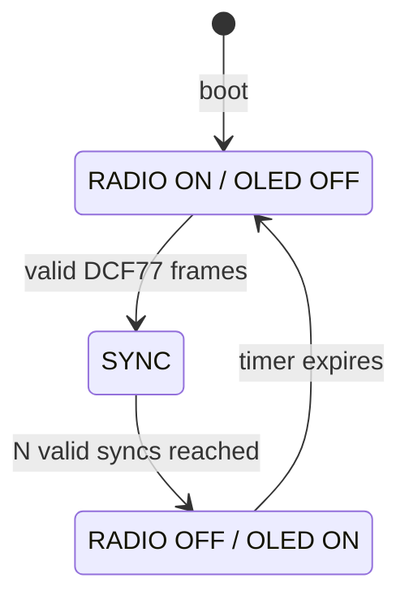

<!--
DCF77 RC8000 Console v2.5.4
Copyright (c) 2026 Gianpaolo P.
Licensed under the PolyForm Noncommercial License 1.0.0.
Commercial use requires a separate written license from the copyright holder.
See LICENSE and NOTICE.md.
-->

# DCF77 RC8000 Console v2.5.4

**ESP8266 / HW-364A** firmware for DCF77 reception and diagnostics with an external **RC8000 / DCF-3850N-800** receiver, Web console, robust frame recovery, integrated OLED support and automatic receiver duty cycling.

> The repository name historically contains `esp32`; release **2.5.4** in this `main` branch targets **ESP8266** and the HW-364A board.

**Documentazione italiana:** [README.md](README.md)

## How DCF77 works

DCF77 is the German standard-time dissemination service operated for PTB on **77.5 kHz**. The transmitter continuously radiates a low-frequency carrier and, once per second, reduces its amplitude to encode one time bit. This project decodes that amplitude-modulated time code.

The basic mechanism is simple and elegant:

~~~text
start of second
      |
      +---- carrier reduction for about 100 ms -> bit 0
      |
      +---- carrier reduction for about 200 ms -> bit 1

second 59
      |
      +---- no reduction -> end-of-minute marker
~~~

A DCF77 minute is therefore effectively a **59-position time frame**. The receiver never gets a literal string such as "22:47:13": it sees a sequence of 100/200 ms pulses aligned to the seconds. The firmware must first recover the 1 Hz rhythm, classify pulses as 0 or 1, identify the missing pulse that separates minutes, and only then decode the time information.

The main part of the telegram is organized as follows:

| Bit | Meaning |
|---:|---|
| 16 | daylight-saving change announcement |
| 17-18 | CEST/CET time-zone flags |
| 19 | leap-second announcement |
| 20 | start-of-time-code, must be 1 |
| 21-27 | minutes in BCD |
| 28 | minute parity |
| 29-34 | hours in BCD |
| 35 | hour parity |
| 36-41 | day of month |
| 42-44 | day of week |
| 45-49 | month |
| 50-57 | year |
| 58 | date parity |

The time carried by the telegram describes **the minute that is about to begin**. When the second-59 marker arrives, the completed frame is validated and the clock can be aligned to the new minute.

### Why this project is interesting

The hard part is not reading zeroes and ones; it is doing so in a noisy electromagnetic environment. At 77.5 kHz, OLED displays, switching supplies, USB, Wi-Fi, the MCU itself and nearby digital wiring can noticeably degrade reception. v2.5.4 therefore:

1. statistically recovers the dominant **1 Hz** phase;
2. assigns pulses to time slots instead of blindly trusting RAW edges;
3. uses DCF77 parity to recover **deterministic erasures**;
4. completely silences OLED/I2C during acquisition;
5. powers the receiver down after valid synchronization and keeps time in **HOLDOVER**;
6. periodically powers the receiver back up to correct local-clock drift.

The result is more than a simple DCF77 bit decoder: it behaves like a compact resilient time receiver that alternates **radio acquisition**, **validation**, **recovery** and **holdover**.

## Release scope

The current `main` tree is intentionally rebuilt around **v2.5.4** only. Older experimental implementations are not part of the current source tree.

The design is based on real noisy-signal testing and centers on four ideas: statistical 1 Hz clock recovery, deterministic erasure reconstruction, a completely quiet OLED while receiving DCF77, and receiver duty cycling after valid synchronization.

## Reference hardware

| Function | Hardware / GPIO | Notes |
|---|---|---|
| MCU / board | HW-364A, ESP8266 | integrated 0.96" 128x64 OLED |
| DCF DATA | GPIO13 | pulse input from RC8000 |
| DCF PON | GPIO5 | **active LOW**: LOW = receiver ON |
| OLED SDA | GPIO14 | integrated HW-364A I2C bus |
| OLED SCL | GPIO12 | integrated HW-364A I2C bus |
| OLED address | `0x3C` | also probes `0x3D`; SH1106 fallback |
| Receiver supply | 3.3 V | common ground with ESP8266 |

GPIO numbers are authoritative because commercial HW-364A documentation is inconsistent about `D5/D6` labels. The firmware also probes the two SDA/SCL orders observed on different board batches.

See [Hardware](docs/HARDWARE.en.md) and [Wiring](docs/WIRING.en.md).

## Why the OLED is off during reception

On the tested assembly, the integrated OLED measurably degraded DCF77 reception. v2.5.4 therefore makes the display part of the receiver duty-cycle state machine instead of merely refreshing it less often.



- **RADIO ON** → OLED off, no periodic I2C display traffic.
- After the configured number of valid frames (default **2**) → PON powers the RC8000 down.
- **RADIO OFF** → OLED turns on and immediately shows local holdover time/date.
- After the configured off interval (default **60 min**) → OLED is turned off **before** the receiver starts again.

## Decoder and frame correction

The decoder does not trust raw edges directly. It recovers a dominant 1 Hz phase, rebuilds second slots and rejects short/out-of-phase events. During frame finalization:

- fixed DCF77 bit 20 can be reconstructed as `1` when missing;
- **one erasure per parity block** can be reconstructed for minute, hour and date blocks;
- therefore a frame with **57 physically observed bits + 2 deterministically recoverable bits** can be accepted;
- the firmware does not guess when multiple solutions remain possible.

See [DCF77 protocol and recovery](docs/DCF77.en.md).

## Main features

- Statistical 1 Hz clock recovery and logical PLL.
- Slot reconstruction and minute-marker inference in noisy conditions.
- Time/date/weekday/CET/CEST/DST/leap-second decoding.
- Parity erasure recovery.
- Basic / Advanced Web console with live 59-bit map.
- Filter quality, recent pulses, histograms, rejection counters and frame statistics.
- 60 s `RF QUIET` comparison with Wi-Fi disabled.
- `AUTO A/B` test for `INPUT` vs `INPUT_PULLUP`.
- Wi-Fi provisioning stored in LittleFS with captive-portal fallback.
- Persistent configurable receiver duty timer.
- SSD1306 128x64 OLED, SH1106 fallback and I2C auto-probing.

## Quick build

Requires [PlatformIO](https://platformio.org/) and the `nodemcuv2` ESP8266 target.

```bash
git clone https://github.com/pgpaolo/esp32-dcf77-diagnostic.git
cd esp32-dcf77-diagnostic
pio run
pio run -t upload
pio device monitor -b 115200
```

Wi-Fi credentials do not need to be compiled into the firmware. If no valid stored configuration exists, the device opens its setup AP. Optional compile-time fallback credentials can be supplied in a local `include/secrets.h`; that file is ignored by Git and must not be published.

See [Build and configuration](docs/BUILD.en.md).

## Known constraints

1. **OLED digital noise:** on the tested hardware it can significantly reduce DCF77 quality, so it remains off while receiving.
2. **Wi-Fi scans:** RF/CPU intensive; only run them when provisioning.
3. **Antenna placement:** 77.5 kHz reception is sensitive to switching supplies, USB, displays, MCUs and nearby digital wiring.
4. **PON polarity:** reference configuration uses GPIO5 active-low.
5. **DATA bias:** plain `INPUT` is the tested default; `AUTO A/B` is provided for comparison.
6. **Recovery limits:** parity reconstruction fixes deterministic erasures, not arbitrary bit flips; two unknown bits in the same parity block are not uniquely solvable.
7. **Seconds:** DCF77 does not transmit a numeric second field; seconds are maintained locally and re-aligned at synchronization.

See [Troubleshooting](docs/TROUBLESHOOTING.en.md).

## Documentation

- [Hardware](docs/HARDWARE.en.md) / [Italiano](docs/HARDWARE.md)
- [Wiring](docs/WIRING.en.md) / [Italiano](docs/WIRING.md)
- [Architecture](docs/ARCHITECTURE.en.md) / [Italiano](docs/ARCHITECTURE.md)
- [DCF77 protocol & recovery](docs/DCF77.en.md) / [Italiano](docs/DCF77.md)
- [Web/API](docs/API.en.md) / [Italiano](docs/API.md)
- [Build](docs/BUILD.en.md) / [Italiano](docs/BUILD.md)
- [Troubleshooting](docs/TROUBLESHOOTING.en.md) / [Italiano](docs/TROUBLESHOOTING.md)
- [Changelog](CHANGELOG.md)

## Technical references

- PTB DCF77 time dissemination: https://www.ptb.de/cms/fileadmin/internet/publikationen/broschueren/About_Time_2019en.pdf
- HW-364A OLED working pinout examples: https://github.com/Bl4d3hUnt3r/HW364-A and https://github.com/dzwiedziu-nkg/nodemcu-with-oled-example

## License

This project is distributed under the **PolyForm Noncommercial License 1.0.0**.

Personal, educational, experimental and **noncommercial** research use is permitted, together with changes and redistribution within the limits of the license. Commercial use — including resale, incorporation into paid products or services, pre-installation on hardware offered for sale, or any use with an anticipated commercial application — requires a **separate commercial license and prior written authorization** from the copyright holder.

Attribution and required notices must be preserved. See [LICENSE](LICENSE) and [NOTICE.md](NOTICE.md).

> This is a **source-available/noncommercial** license, not a permissive open-source license such as MIT.
