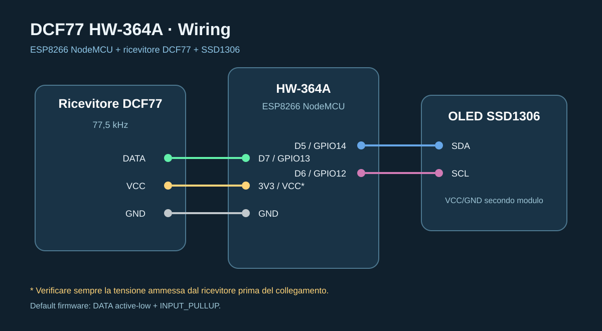

# DCF77 HW-364A

[](https://github.com/pgpaolo/esp32-dcf77-diagnostic/actions/workflows/platformio.yml)


Firmware dedicato a **ESP8266 NodeMCU HW-364A + OLED SSD1306 + ricevitore DCF77 77,5 kHz**.

## Stato del progetto

| Voce | Stato |
|---|---|
| Sviluppo | **RAW HARDWARE VALIDATION** |
| Target | HW-364A / ESP8266 |
| Ricevitore | DCF-3850N-800 / SP6007 |
| Segnale | DCF77 77,5 kHz |
| Modalità corrente | acquisizione RAW |
| Decoder ora/data | temporaneamente non attivo |
| Environment PlatformIO | `hw364a` |

La versione corrente è volutamente ridotta alla sola **acquisizione RAW** del segnale della ricevente. Prima si validano livello logico, edge, impulsi e periodo; solo dopo verrà riattivata la decodifica completa.


## Profilo PlatformIO predefinito

Il profilo **HW364A è il default del progetto**:

```ini
[platformio]
default_envs = hw364a
```

Quindi per compilare e caricare non è necessario specificare `-e hw364a`:

```bash
pio run
pio run -t upload
pio device monitor
```

Il comando esplicito resta comunque valido:

```bash
pio run -e hw364a
```

## Collegamenti




| Funzione | HW-364A |
|---|---:|
| T / DATA ricevitore | D7 / GPIO13 |
| P1 / PON ricevitore | D1 / GPIO5, forzato LOW |
| OLED SDA | D5 / GPIO14 |
| OLED SCL | D6 / GPIO12 |
| Pulsante pagina | FLASH / GPIO0 |
| GND | GND |

La configurazione predefinita considera DATA **active-low con pull-up interno**. Se il modulo acquistato fornisce un'uscita attiva alta, impostare `DCF77_ACTIVE_LOW=0` in `platformio.ini`.

> Verificare sempre tensione di alimentazione e pinout del modulo utilizzato: i ricevitori DCF77 commerciali non hanno tutti la stessa disposizione dei pin.

### Controllo hardware PON

Il pin `PON` del ricevitore è gestito separatamente dalla modalità software **ACCUMULO**.

Configurazione predefinita:

```text
PON -> D1 / GPIO5
LOW = ricevitore attivo
HIGH = ricevitore disabilitato
```

Dal portale web sono disponibili **ON**, **OFF** e **Restart 3 s**. Il restart porta PON nello stato OFF per 3 secondi e poi riattiva il modulo, azzerando contestualmente lo stato del decoder.

## Come viene codificato DCF77

DCF77 trasmette su **77,5 kHz**. Ogni secondo, eccetto il secondo 59, la portante viene attenuata all'inizio del secondo:

- attenuazione di circa **100 ms** = bit `0`;
- attenuazione di circa **200 ms** = bit `1`;
- al **secondo 59** l'impulso AM viene omesso: il ricevitore osserva quindi un intervallo di circa 2 s tra gli inizi degli impulsi del secondo 58 e del secondo 0 successivo.

Il frame contiene 59 bit utili. I campi principali sono:

- secondo 16: annuncio cambio ora legale;
- 17-18: CET/CEST;
- 19: annuncio secondo intercalare;
- 20: start-of-time-information;
- 21-27: minuti BCD;
- 28: parità minuti;
- 29-34: ore BCD;
- 35: parità ore;
- 36-58: data, giorno settimana, mese, anno e parità data.

La documentazione dettagliata è in [docs/DCF77_FRAME.md](docs/DCF77_FRAME.md).

## Funzionamento del firmware

Il firmware misura direttamente gli edge dell'uscita digitale del ricevitore:

1. rileva l'inizio dell'impulso;
2. misura la larghezza;
3. classifica 100 ms come `0` e 200 ms come `1`;
4. misura l'intervallo tra gli inizi degli impulsi;
5. riconosce il marker minuto quando l'intervallo è vicino a 2 s;
6. raccoglie 59 bit;
7. verifica struttura, BCD, parità P1/P2/P3 e plausibilità della data/ora;
8. aggiorna la griglia grafica dei 59 bit con confidenza individuale.

### Decoder temporaneamente sospeso

Le modalità DIRETTA/ACCUMULO restano documentate come sviluppo successivo, ma **non sono il riferimento della build corrente**. Prima deve essere dimostrata una ricezione RAW stabile dal pin T del modulo.


## Console web

La console web è stata mantenuta volutamente semplice: deve mostrare immediatamente se il ricevitore sta producendo impulsi DCF77 plausibili e se il frame è sincronizzato.


Per una descrizione completa dei campi vedere [docs/CONSOLE.md](docs/CONSOLE.md).

All'avvio resta disponibile l'AP:

`DCF77-HW364A-xxxxxx`

con portale su `http://192.168.4.1`.

La console mostra:

- selettore **DIRETTA / ACCUMULO**;
- ora e data sincronizzate;
- stato SEARCH/SYNC;
- qualità del segnale;
- posizione del frame;
- griglia grafica dei **59 bit DCF77**, con valore e confidenza;
- colori distinti per servizio, zona/controllo, minuti, ore e data;
- stato dell'accumulo: minuti candidati coerenti, confidenza dei campi, bit incerti e bit recuperati;
- ultimo impulso, periodo e marker minuto;
- frame validi/invalidi;
- errori di parità e timing;
- tabella degli impulsi recenti;
- diagnostica avanzata con uptime, heap, RSSI, jitter RMS, rapporto impulsi validi, glitch, età dell'ultimo frame valido e stato P1/P2/P3;
- distribuzione degli ultimi impulsi fra bit 0, bit 1 e simboli incerti;
- configurazione Wi-Fi;
- scelta persistente della schermata OLED: **AUTO**, **ORA**, **SEGNALE**, **DECODER/ACCUMULO** oppure **DIAGNOSTICA**.

## Struttura essenziale

- `src/main.cpp`: acquisizione interrupt;
- `src/dcf77_decoder.cpp`: decodifica DCF77;
- `src/ui_oled.cpp`: OLED;
- `src/web_portal.cpp`: console web;
- `include/config.h`: pin, polarità e finestre temporali.

Vedi anche [docs/HW364A.md](docs/HW364A.md) e [docs/DCF77_FRAME.md](docs/DCF77_FRAME.md).

## Visualizzazione OLED configurabile

Dal portale web è possibile decidere cosa mostrare stabilmente sul display OLED.

| Modalità | Contenuto |
|---|---|
| AUTO | rotazione automatica fra le quattro schermate |
| ORA | ora, data e contatori frame |
| SEGNALE | impulso, periodo, bit/confidenza e jitter RMS |
| DECODER | posizione frame e stato accumulo/decodifica |
| DIAGNOSTICA | percentuale impulsi validi, heap, RSSI, glitch, timing e lock |

La selezione viene salvata in EEPROM insieme alla modalità del decoder e resta attiva dopo il riavvio.


## Documentazione

| Documento | Contenuto |
|---|---|
| [Baseline RAW](docs/RAW_BASELINE.md) | acquisizione grezza del DCF-3850N-800 |
| [HW364A](docs/HW364A.md) | cablaggio, polarità, compilazione e collaudo hardware |
| [Codifica DCF77](docs/DCF77_FRAME.md) | struttura del minuto, BCD, CET/CEST e parità |
| [Architettura](docs/ARCHITECTURE.md) | flusso dati, ISR, decoder, clock, EEPROM |
| [Console web](docs/CONSOLE.md) | interfaccia, accumulo, diagnostica e OLED |
| [API](docs/API.md) | endpoint HTTP e payload principali |
| [Troubleshooting](docs/TROUBLESHOOTING.md) | diagnosi passo-passo e valori attesi |
| [Hardware compatibile](docs/HARDWARE.md) | requisiti elettrici e checklist ricevitore |
| [Changelog](CHANGELOG.md) | modifiche e stato pre-release |
| [Contributing](CONTRIBUTING.md) | build, stile e pull request |
| [Security](SECURITY.md) | uso sicuro della console locale |

## CI / controllo build

Ogni push su `main` e ogni pull request eseguono automaticamente:

```bash
pio run
```

sul target predefinito `hw364a`. Il badge in testa al README mostra lo stato della build corrente.
