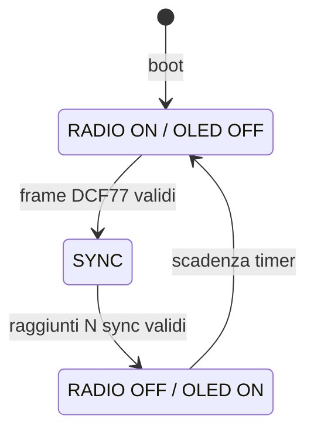

# DCF77 RC8000 Console v2.5.4

Firmware **ESP8266 / HW-364A** per la ricezione e la diagnostica DCF77 con ricevitore esterno **RC8000 / DCF-3850N-800**, console Web, recupero robusto dei frame, OLED integrato e duty-cycle automatico della radio.

> Il nome storico del repository contiene `esp32`, ma la release **2.5.4** qui pubblicata è specifica per **ESP8266** e per la board HW-364A.

**English documentation:** [README.en.md](README.en.md)

## Stato della release

Questa branch `main` contiene esclusivamente la base **v2.5.4**. Le versioni sperimentali precedenti non fanno parte dell'albero corrente.

La 2.5.4 nasce da prove reali su segnale DCF77 disturbato e mantiene quattro principi: recupero del clock a 1 Hz, ricostruzione deterministica degli erasure, OLED completamente silenzioso durante la ricezione e spegnimento temporizzato del ricevitore dopo sincronizzazioni valide.

## Hardware di riferimento

| Funzione | Hardware / GPIO | Note |
|---|---|---|
| MCU / board | HW-364A, ESP8266 | OLED 0.96" 128x64 integrato |
| DCF DATA | GPIO13 | ingresso impulsi dal RC8000 |
| DCF PON | GPIO5 | **active LOW**: LOW = ricevitore ON |
| OLED SDA | GPIO14 | bus I2C integrato HW-364A |
| OLED SCL | GPIO12 | bus I2C integrato HW-364A |
| OLED address | `0x3C` | probe anche `0x3D`; fallback SH1106 |
| Alimentazione ricevitore | 3.3 V | massa comune con ESP8266 |

I numeri **GPIO** sono il riferimento autorevole: la serigrafia `D5/D6` non è uniforme nelle documentazioni commerciali della HW-364A. Il firmware esegue inoltre un probe delle due possibili polarità SDA/SCL osservate su differenti batch.

Dettagli: [Hardware](docs/HARDWARE.md) · [Cablaggio](docs/WIRING.md)

## Perché l'OLED viene spento durante la ricerca

Sul banco di prova il display integrato ha ridotto sensibilmente la qualità del segnale ricevuto. La v2.5.4 quindi **non aggiorna semplicemente meno spesso l'OLED**: lo rende RF-quiet mentre il ricevitore è acceso.



- **RADIO ON** → OLED OFF, niente refresh e niente traffico I2C periodico.
- Dopo il numero configurato di frame validi (default **2**) → PON spegne RC8000.
- **RADIO OFF** → OLED ON e visualizzazione immediata di ora/data in HOLDOVER.
- Dopo il tempo configurato (default **60 min**) → OLED OFF **prima** della riaccensione del ricevitore.

## Decoder e correzione del frame

La decodifica non si basa sui fronti RAW in modo ingenuo. Il firmware recupera una fase dominante a 1 Hz, ricostruisce slot temporali e filtra glitch / impulsi fuori fase. In fase di finalizzazione:

- il bit 20, fisso a `1`, può essere ricostruito se assente;
- è recuperabile **un bit mancante per ciascun blocco di parità**: minuti, ore, data;
- un frame con **57 bit fisici + 2 bit determinabili** può quindi essere salvato;
- non vengono inventati bit quando più soluzioni restano possibili.

Vedi [Protocollo e recovery DCF77](docs/DCF77.md).

## Funzioni principali

- Clock recovery statistico e PLL logico a 1 Hz.
- Ricostruzione slot 0..58 e marker del minuto anche se coperto da rumore.
- Decodifica ora, data, giorno settimana, CET/CEST, annuncio DST e leap second.
- Parity erasure recovery per minuti / ore / data.
- Console Web Basic / Advanced e mappa live dei 59 bit.
- Qualità filtro, impulsi recenti, histogram, contatori reject e frame OK/KO.
- `RF QUIET` di 60 s per confrontare ricezione con Wi-Fi spento.
- test `AUTO A/B` tra `INPUT` e `INPUT_PULLUP`.
- Configurazione Wi-Fi via Web e LittleFS, con captive portal di fallback.
- Timer radio configurabile e persistente in LittleFS.
- OLED SSD1306 128x64; fallback SH1106 e auto-probe I2C.

## Build rapido

Richiede [PlatformIO](https://platformio.org/) e un ESP8266 compatibile `nodemcuv2`.

```bash
git clone https://github.com/pgpaolo/esp32-dcf77-diagnostic.git
cd esp32-dcf77-diagnostic
pio run
pio run -t upload
pio device monitor -b 115200
```

Non è necessario inserire credenziali Wi-Fi nel sorgente. Al primo avvio senza configurazione valida viene creato un access point di setup. In alternativa è possibile creare localmente `include/secrets.h` con `WIFI_SSID` e `WIFI_PASSWORD`. Il file è escluso da Git e non deve essere pubblicato.

Guida completa: [Build e configurazione](docs/BUILD.md).

## Wi-Fi di setup

Se la connessione STA non riesce, il firmware crea un AP `DCF77-Setup-XXXXXX`, espone il portale su `192.168.4.1` e consente di salvare SSID/password/hostname in LittleFS. La scansione delle reti è **solo on-demand**, perché può peggiorare temporaneamente la ricezione.

> La password dell'AP di setup è una credenziale di provisioning, non una misura di sicurezza per reti ostili. Usare il dispositivo su una LAN fidata.

## Criticità note

1. **OLED / rumore digitale:** sul sistema testato può degradare fortemente DCF77; per questo è spento durante RX.
2. **Wi-Fi scan:** genera attività RF e CPU significativa; usarla solo per configurazione.
3. **Posizionamento antenna:** il DCF77 a 77.5 kHz è sensibile a alimentatori switching, USB, display, MCU e cablaggi digitali vicini.
4. **PON:** GPIO5 è active-low nella configurazione di riferimento; un'inversione lascia il ricevitore spento.
5. **DATA bias:** `INPUT` è il default che ha dato i risultati migliori sul banco; `AUTO A/B` permette una verifica sperimentale.
6. **Recovery:** la parità corregge erasure deterministiche, non bit arbitrariamente errati. Due missing nello stesso blocco di parità non sono univocamente ricostruibili.
7. **Secondi:** DCF77 non trasmette un valore numerico dei secondi; vengono derivati localmente e riallineati al marker.

Vedi [Troubleshooting](docs/TROUBLESHOOTING.md).

## Documentazione

- [Hardware](docs/HARDWARE.md) / [English](docs/HARDWARE.en.md)
- [Cablaggio](docs/WIRING.md) / [English](docs/WIRING.en.md)
- [Architettura](docs/ARCHITECTURE.md) / [English](docs/ARCHITECTURE.en.md)
- [DCF77 e correzione](docs/DCF77.md) / [English](docs/DCF77.en.md)
- [Web/API](docs/API.md) / [English](docs/API.en.md)
- [Build](docs/BUILD.md) / [English](docs/BUILD.en.md)
- [Troubleshooting](docs/TROUBLESHOOTING.md) / [English](docs/TROUBLESHOOTING.en.md)
- [Changelog](CHANGELOG.md)

## Riferimenti tecnici

- PTB, DCF77 standard-frequency and time dissemination transmitter: https://www.ptb.de/cms/fileadmin/internet/publikationen/broschueren/About_Time_2019en.pdf
- HW-364A OLED pinout / working examples: https://github.com/Bl4d3hUnt3r/HW364-A and https://github.com/dzwiedziu-nkg/nodemcu-with-oled-example

## Licenza

MIT. Vedi [LICENSE](LICENSE).
