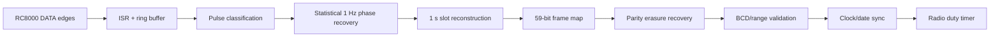
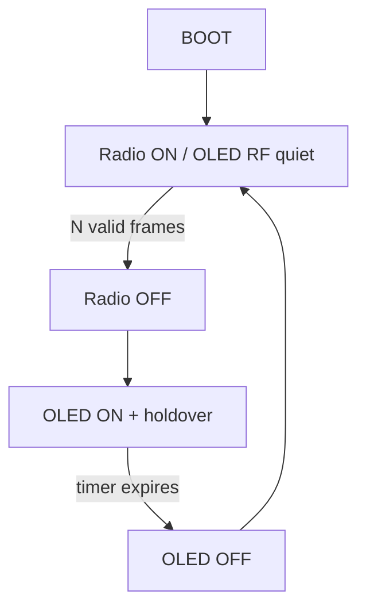

<!--
DCF77 RC8000 Console v2.5.4
Copyright (c) 2026 Gianpaolo P.
Licensed under the PolyForm Noncommercial License 1.0.0.
Commercial use requires a separate written license from the copyright holder.
See LICENSE and NOTICE.md.
-->

# Firmware architecture

## Reception pipeline

### ISR and queue
The interrupt handler captures edges/durations and defers heavy work to the main loop.

### Statistical phase recovery
A dominant phase modulo one second is estimated. Very short or out-of-phase events are rejected before logical decoding. This is what allows useful timing recovery even when the RAW edge stream is noisy.

### Slot reconstruction
The decoder selects the best cluster for each one-second slot and can merge fragmented pulses. Slot indexing is relative to the minute marker and the frame never grows beyond 59 bit positions.

### Minute marker
The minute boundary can be observed as the missing 59th pulse or inferred from timing when noise covers the physical gap.

### Frame recovery
Finalization works on a copy of the bit array and `seen[]` flags. Only uniquely determined values from fixed protocol bits or parity are reconstructed.

### Holdover
After valid DCF synchronization, local seconds continue from `millis()` and are re-aligned on subsequent synchronization.

## Radio / display state machine

Persistent settings:

- `radioDutyEnabled`
- `radioSyncTarget` (1..10, default 2)
- `radioOffMinutes` (1..1440, default 60)

## DCF Priority Scheduler

When the PLL is locked, Web/mDNS service work is kept outside the critical DCF portion of the second. v2.5.4 adds a stronger OLED rule: **no OLED refresh while RADIO is ON**.

## Persistence

LittleFS stores:

- `/wifi.cfg` — SSID, password, hostname;
- `/radio.cfg` — enable flag, synchronization target and OFF minutes.

## Diagnostics

The Web UI exposes RAW/filter quality, pulse histogram, short/width/phase rejects, observed/inferred markers, lost/recovered bits, frame statistics, RF QUIET, AUTO A/B, OLED/I2C state and radio duty-cycle state.
