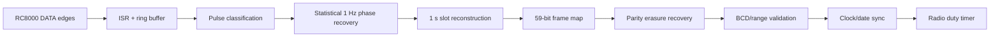
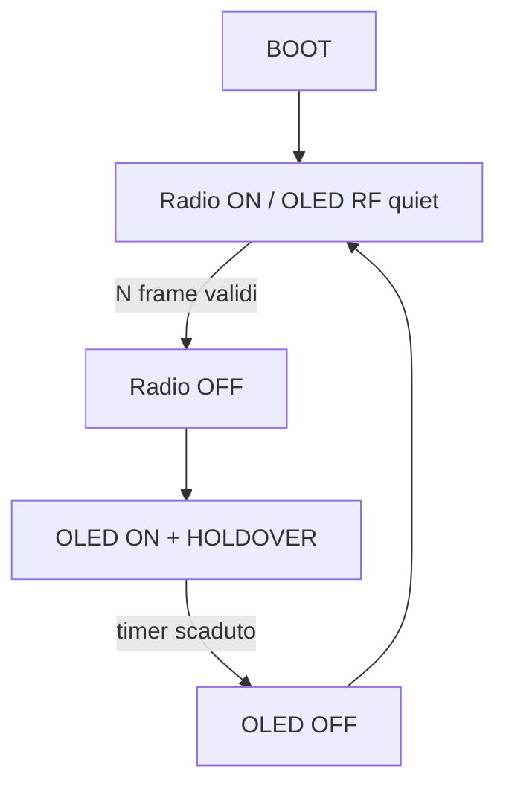

<!--
DCF77 RC8000 Console v2.5.4
Copyright (c) 2026 Gianpaolo P.
Licensed under the PolyForm Noncommercial License 1.0.0.
Commercial use requires a separate written license from the copyright holder.
See LICENSE and NOTICE.md.
-->

# Architettura firmware

## Pipeline di ricezione

### 1. ISR e coda

L'interrupt acquisisce fronti e durate senza fare decodifica pesante. Gli eventi vengono consumati nel `loop()`.

### 2. Recupero fase

La fase dominante è stimata modulo 1 secondo. Eventi troppo corti o lontani dalla fase attesa non entrano nel decoder logico. Questo permette di mantenere il lock anche con molti spike.

### 3. Slot reconstruction

Per ogni secondo viene ricostruito il cluster migliore; impulsi frammentati possono essere fusi. Gli slot sono indicizzati rispetto al marker di minuto e il frame non può crescere oltre 59 bit.

### 4. Marker

Il marker del minuto può essere osservato come assenza del 59° impulso oppure inferito temporalmente se rumore/spike coprono la pausa.

### 5. Frame recovery

La finalizzazione lavora su una copia del frame e dei flag `seen[]`. Vengono ricostruiti soltanto valori determinabili univocamente da bit fissi o parità.

### 6. Holdover

Dopo un frame valido, `millis()` mantiene i secondi locali. Il clock viene riallineato al successivo sync DCF.

## State machine radio / display

Parametri persistenti:

- `radioDutyEnabled`
- `radioSyncTarget` (1..10, default 2)
- `radioOffMinutes` (1..1440, default 60)

## DCF Priority Scheduler

Quando il PLL è agganciato, i servizi Web/mDNS vengono serviti fuori dalla finestra critica del secondo DCF. Nella 2.5.4 questo si combina con la policy più forte per il display: **nessun refresh OLED durante RADIO ON**.

## Persistenza

LittleFS contiene:

- `/wifi.cfg` — SSID, password, hostname;
- `/radio.cfg` — enable, sync target, minuti OFF.

## Diagnostica

Sono disponibili:

- qualità RAW e filtro;
- histogram impulsi;
- reject short/width/phase;
- marker osservati/inferiti;
- bit persi e bit recuperati;
- frame validi/invalidi;
- RF QUIET e AUTO A/B;
- stato OLED / I2C;
- duty-cycle radio.
