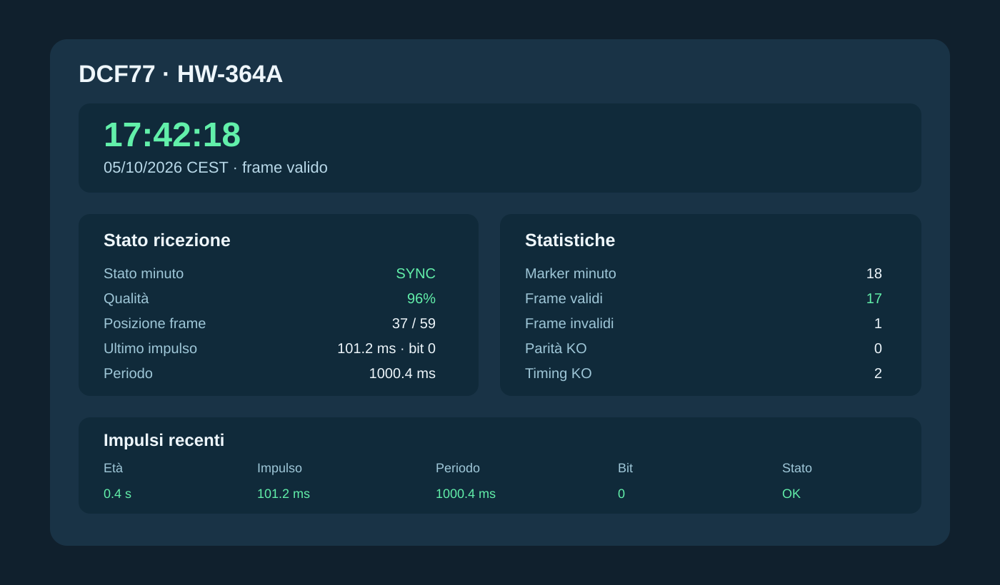

# HW-364A + ricevitore DCF77

## Configurazione di riferimento

Questo progetto è ora dedicato esclusivamente a:

- ESP8266 NodeMCU / HW-364A;
- OLED SSD1306 128x64;
- ricevitore DCF77 77,5 kHz con uscita digitale.

Il profilo PlatformIO `hw364a` è impostato come **default_envs**, quindi:

```bash
pio run
pio run -t upload
```

compilano e caricano direttamente il firmware corretto.

## Collegamento

- DATA ricevitore -> D7 / GPIO13
- GND ricevitore -> GND
- alimentazione ricevitore -> secondo specifiche del modulo
- OLED SDA -> D5 / GPIO14
- OLED SCL -> D6 / GPIO12
- pulsante pagina -> GPIO0 / FLASH

Configurazione predefinita:

```ini
-D DCF77_ACTIVE_LOW=1
-D DCF77_USE_INTERNAL_PULLUP=1
```

Se il nuovo modulo ha uscita attiva alta:

```ini
-D DCF77_ACTIVE_LOW=0
```

Se il modulo possiede già un pull-up adeguato e non deve essere usato quello interno:

```ini
-D DCF77_USE_INTERNAL_PULLUP=0
```

## Verifica immediata

Con ricezione corretta il monitor deve mostrare prevalentemente:

```text
Impulso ~100 ms   -> bit 0
Impulso ~200 ms   -> bit 1
Periodo ~1000 ms  -> secondo normale
Periodo ~2000 ms  -> marker minuto
```

Dopo il primo marker il contatore frame deve avanzare verso 59. Al marker successivo il frame viene validato tramite BCD, parità e plausibilità temporale.

## Console



La console web è raggiungibile tramite AP locale `DCF77-HW364A-xxxxxx` all'indirizzo:

`http://192.168.4.1`


## Diagnostica

Se non si ricevono impulsi regolari:

1. verificare la polarità DATA;
2. verificare VCC/GND e tensione prevista dal modulo;
3. allontanare antenna e ricevitore da ESP8266, alimentatori switching, USB e display;
4. ruotare l'antenna in ferrite per massimizzare il segnale;
5. verificare che le larghezze siano realmente vicine a 100/200 ms.

Con una ricevente DCF77 corretta non è necessario ricostruire il segnale tramite PLL o filtri software complessi.


## Sequenza consigliata di collaudo

1. compilare con `pio run`;
2. caricare con `pio run -t upload`;
3. aprire il monitor seriale con `pio device monitor`;
4. verificare impulsi prossimi a 100/200 ms;
5. attendere il primo periodo vicino a 2000 ms;
6. verificare che la posizione frame avanzi da 0 a 58;
7. attendere il frame successivo e controllare parità e ora/data.

Se il modulo è corretto, non devono essere necessari PLL software o ricostruzioni del segnale.
